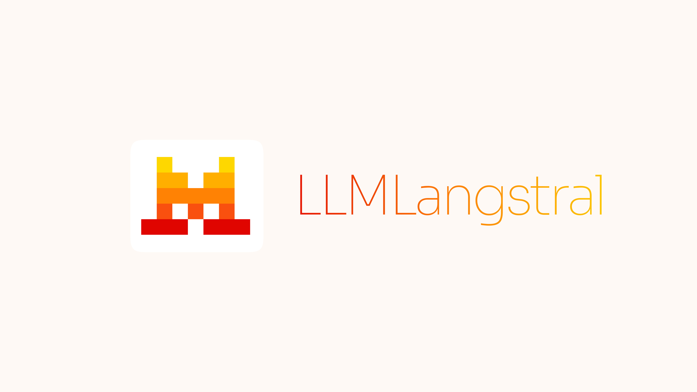

# LLMLangstral

<p align="center">
  
</p>

**Réduisez vos coûts d'API jusqu'à 20x en compressant intelligemment vos prompts.**

---

## Le problème

Les grands modèles de langage (LLM) comme GPT-4, Claude ou Mistral facturent à l'utilisation de tokens. Plus votre prompt est long, plus vous payez cher. De plus, chaque modèle a une limite de contexte : au-delà, il ne peut plus traiter votre texte.

Concrètement, cela signifie :

- Des factures d'API qui explosent sur des projets à fort volume
- L'impossibilité de traiter des documents longs en une seule requête
- Des performances dégradées quand le modèle "oublie" les informations au milieu d'un long contexte

---

## La solution

LLMLangstral analyse votre texte et supprime les mots non essentiels tout en préservant le sens. Le résultat : un prompt plus court qui transmet la même information au LLM.

**Exemple concret :**

| Avant compression | Après compression |
|-------------------|-------------------|
| 2000 tokens | 200 tokens |
| Coût : 0,06 $ | Coût : 0,006 $ |

Le LLM reçoit moins de tokens mais comprend toujours le contexte. Vous économisez 90% sur cet appel.

---

## Comment ça fonctionne

LLMLangstral utilise un petit modèle de langage local (basé sur l'architecture Mistral) pour évaluer l'importance de chaque mot. Les mots à faible valeur informative sont retirés, les mots clés sont conservés.

Le processus se déroule en trois étapes :

1. **Analyse** — Le texte est découpé en segments (phrases, paragraphes)
2. **Évaluation** — Chaque segment reçoit un score d'importance
3. **Compression** — Les segments les moins importants sont supprimés ou abrégés

Tout se passe localement sur votre machine. Aucune donnée n'est envoyée à un service externe pendant la compression.

---

## Les variantes disponibles

LLMLangstral expose une seule classe `PromptCompressor` adossée à un backbone Mistral. Deux modes d'utilisation :

### LLMLangstral

La méthode de base. Elle utilise la perplexité (une mesure de "surprise" du modèle) pour identifier les tokens importants. Efficace pour la plupart des cas d'usage.

### LongLLMLangstral

Même backbone Mistral, activé via `compress_prompt(..., use_context_level_filter=True, rank_method="longllmlingua")`. Optimisée pour les longs documents — elle résout le problème du "lost in the middle" où les LLM ont tendance à oublier les informations situées au centre d'un long texte. Particulièrement utile pour le RAG (Retrieval-Augmented Generation).

> **Note (v0.3.0)** — Les variantes **LLMLangstral-2** (XLM-RoBERTa token classification, 3-6x plus rapide) et **SecurityLingua** (détection de jailbreak) ont été retirées. Aucun équivalent Mistral n'existe à ce jour. Les pipelines d'entraînement restent disponibles sur la branche `legacy/experiments` pour réutilisation future.

---

## Cas d'usage

### Réduction des coûts d'API

Compressez systématiquement vos prompts avant de les envoyer à GPT-4 ou Claude. Économies typiques : 50 à 90% selon le type de contenu.

### Traitement de documents longs

Résumez des rapports, des transcriptions de réunions ou des bases de connaissances qui dépassent la limite de contexte du modèle cible.

### Amélioration du RAG

Dans un pipeline RAG, compressez les documents récupérés avant de les injecter dans le prompt. Cela permet d'inclure plus de contexte pertinent sans dépasser les limites.

### Accélération de l'inférence

Moins de tokens à traiter signifie une réponse plus rapide du LLM. Utile pour les applications temps réel.

---

## Modèles utilisés

LLMLangstral s'appuie principalement sur des modèles Mistral AI :

| Usage | Modèle | Taille |
|-------|--------|--------|
| Compression standard | Mistral 7B v0.3 | 7 milliards de paramètres |
| Compression légère | Ministral 3B | 3 milliards de paramètres |
| Ressources limitées | Mistral 7B GPTQ | Version quantifiée, moins de 8 Go de VRAM |
| Ranking de documents | E5-Mistral 7B | Embeddings pour le tri par pertinence |

---

## Avantages clés

**Économique** — Réduction drastique des coûts d'API sans perte de qualité perceptible.

**Portable** — Fonctionne avec n'importe quel LLM cible (OpenAI, Anthropic, Mistral, modèles open source).

**Local** — La compression s'effectue sur votre infrastructure. Vos données restent privées.

**Flexible** — Contrôle fin du taux de compression par section du prompt.

---

## Limites

- La compression peut occasionnellement supprimer des informations pertinentes
- Les modèles de compression nécessitent un GPU pour des performances optimales (CPU possible mais plus lent)
- La v0.3.0 retire le chemin "compression rapide" (LLMLingua-2 XLM-RoBERTa) — perte de 3-6x en débit par rapport à la v0.2.x. Aucun équivalent Mistral pré-entraîné n'existe à ce jour.

---

## Migration depuis v0.2.x

La v0.3.0 est une release breaking-change. Si vous migrez depuis la 0.2.x :

**1. Retirez ces kwargs du constructeur** `PromptCompressor(...)` :

- `open_api_config`
- `use_llmlingua2`
- `use_slingua`
- `llmlingua2_config`

**2. Retirez ces kwargs de `compress_prompt(...)`** :

- `return_word_label`
- `word_sep`
- `label_sep`
- `token_to_word`
- `force_tokens`
- `force_reserve_digit`
- `drop_consecutive`
- `chunk_end_tokens`

**3. Classes / symboles supprimés** (ImportError si vous les importiez) :

- `LLMLingua2Compressor` (chemin XLM-RoBERTa)
- `LLMLANGSTRAL2_MODEL`
- 9 rankers non-Mistral : `OpenAIRanker`, `VoyageAIRanker`, `CohereRanker`, `BGERanker`, `SentBertRanker`, `JinzaRanker`, `BGEReranker`, `BGELLMEmbedderRanker`, `APIBasedRanker`
- 4 helpers utils LLMLingua-2-only : `TokenClfDataset`, `is_begin_of_new_word`, `replace_added_token`, `get_pure_token`

**4. Si vous avez besoin de stabilité, restez sur 0.2.x** :

```bash
pip install "llmlangstral<0.3.0"
```

**5. Si vous avez besoin du pipeline d'entraînement LLMLingua-2 / SecurityLingua** : checkout la branche `legacy/experiments` du repo GitHub.

Le registre des rankers en v0.3.0 contient exactement 5 clés : `bm25`, `gzip`, `llmlingua`, `longllmlingua`, `mistral`.

**Astuce post-pull** : si vous voyez des `ImportError` étranges après un `git pull` sur un install editable, regénérez le metadata :

```bash
rm -rf llmlangstral.egg-info && pip install -e ".[dev]"
```

---

## Origine du projet

LLMLangstral est un fork du projet LLMLingua de Microsoft Research, adapté pour utiliser principalement des modèles Mistral AI. Les travaux de recherche originaux ont été publiés à EMNLP 2023 et ACL 2024.

---

## Ressources

- Documentation technique détaillée : voir le fichier DOCUMENT.md
- Exemples pratiques : dossier examples/
- FAQ : fichier Transparency_FAQ.md

---

## Licence

MIT License — Utilisation libre pour projets personnels et commerciaux.
